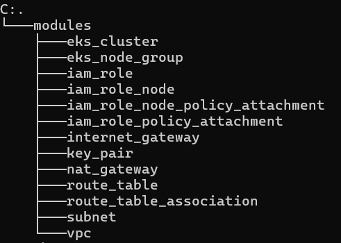
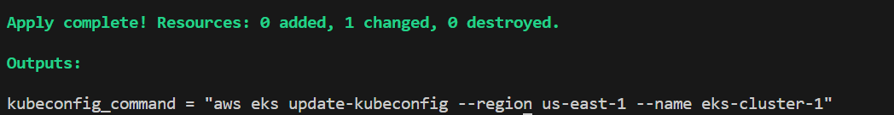
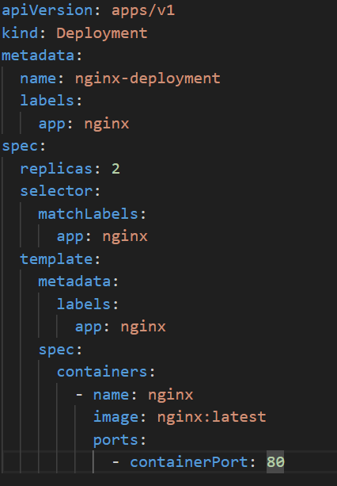
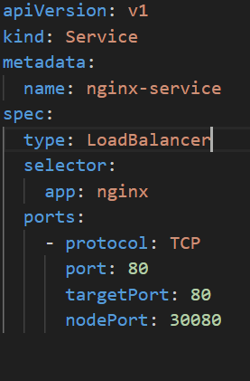
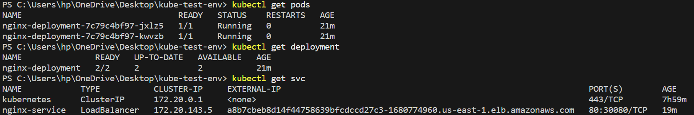
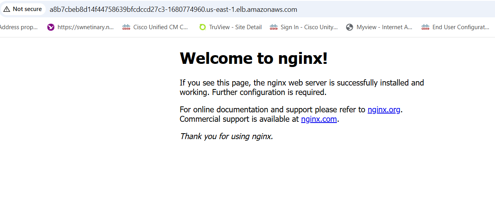
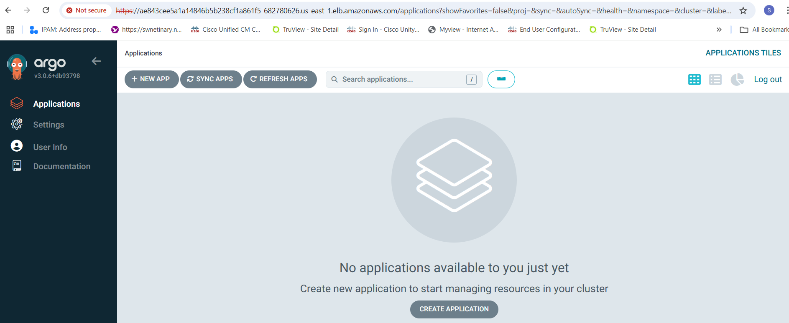
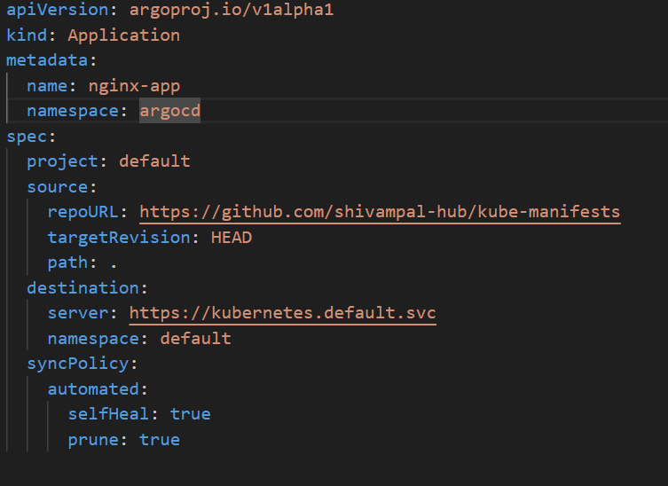
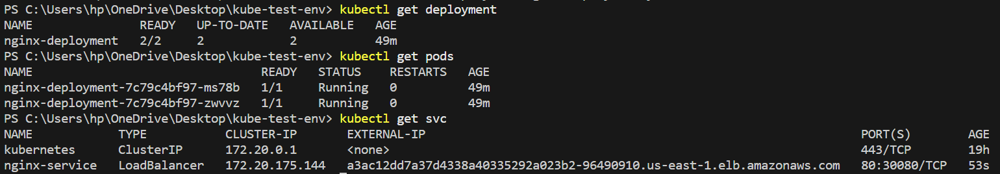
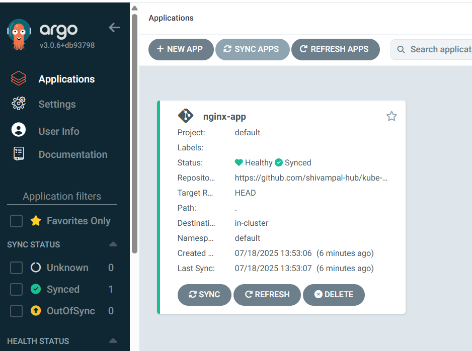

# 1. Provision AWS EKS Cluster using Terraform

    This Project involves AWS EKS Provisioning using Terraform.
    Here we are using Terraform modules to provision a clean and reusable Infrastructure for EKS Cluster.

## Terraform Module Structure

## Project Structure
- "main.tf": Entry point that calls modules and configures the EKS cluster
- "modules/": Reusable Terraform modules for VPC, EKS, IAM, etc.
- "outputs.tf": Useful outputs such as cluster name, endpoint, and kubeconfig command
- "variables.tf: custom input variables

### 1. Clone the repository
    git clone https://github.com/shivampal-hub/appscrip.git
    cd appscrip

### 2. Configure AWS CLI using Access and Secret Key
    aws configure

### 3. Initialize Terraform
    terraform init
    
### 4. Plan the Deployment
    terraform plan
### 5. Apply the Configuration
    terraform apply

### Access the Cluster
    Using Output file we get the below command which we use to access our cluster

    aws eks update-kubeconfig --region us-east-1 --name eks-cluster-1

### then verify using below command
    kubectl get nodes

 The Cluster is successfully  created and now we can use it for our deployment.

# 2. Deploy an NGINX Application using a Kubernetes Manifest

    This project involves deploying nginx application using kubernetes manifests.In our case we would be creating two manifest files:
    - "nginx-deployment.yaml"
    - "nginx-service.yaml"

Since we need to expose our service to the outer world , hence we are using LoadBalancer as a service instead of NodePort.
We can also use NodePort(used to expose app to external clients without Load Balancing) or ClusterIP(used for pod to pod communication within the cluster) as a service.

### Here , we are using kubectl apply method to create our deployment and thus run the below commands
    kubectl apply -f nginx-deployment.yaml
    kubectl apply -f nginx-service.yaml

### Now our nginx-deployment will be up and running and exposed with the help of a Load Balancer.

### Use the External-IP in your browser to access the website.

### Nginx Application is successfully deployed using Kubernetes Manifest.

# 3. Set Up ArgoCD on EKS to deploy NGINX application
    Firstly we need to setup and install ARGOCD in our cluster.
### Install ArgoCD in the argocd namespace.

### Create the argocd namespace
    kubectl create namespace argocd
        
### Install ArgoCD using ArgoCD Install manifest:
    kubectl apply -n argocd -f https://raw.githubusercontent.com/argoproj/argo-cd/stable/manifests/install.yaml
### It will install all argocd components.

### Expose ArgoCD Server with a Load Balancer
    kubectl patch svc argocd-server -n argocd -p '{"spec": {"type": "LoadBalancer"}}'
    kubectl get svc -n argocd

### Use the External-IP of argocd-server.Open https://<external-ip> in your browser.
        
### Get the Initial Admin Password
    kubectl get secret argocd-initial-admin-secret -n argocd -o jsonpath="{.data.password}" | base64 --decode
    
### Use below credentials as admin and password
    username: admin
    password: vcJLBbpU759hSE2Q

### ArgoCD setup is successfully done.

Now we need to store our kube manifests files in our git repo which we will use to create our application.

### Manifest Files -
    - "nginx-deployment.yaml"
    - "nginx-service.yaml"

    git repo - https://github.com/shivampal-hub/kube-manifests

Now we need to create ArgoCD Application using below Manifest

### Apply this using kubectl
    kubectl apply -f nginx-app.yaml

### ArgoCD Application running nginx-app is shown below

### Once we hit the Load Balancer URL in our browser , we get below application up and running. 

